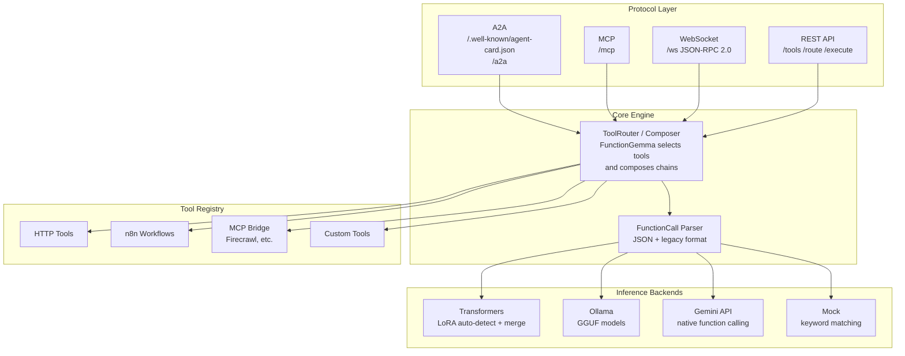
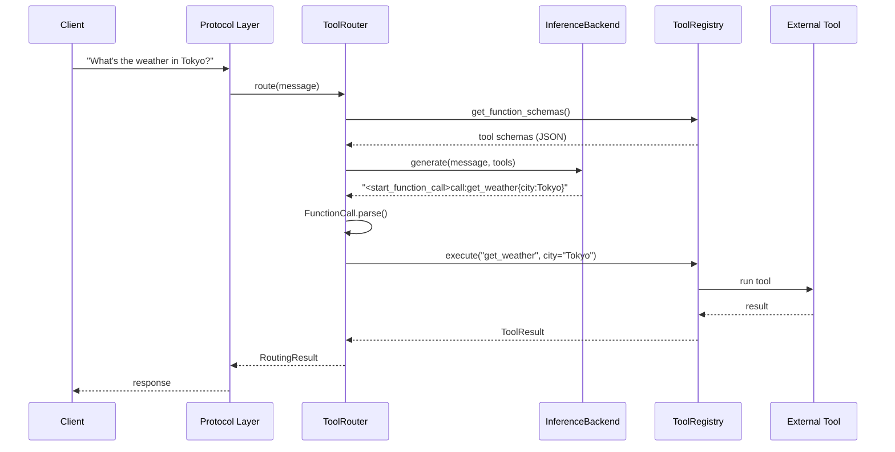
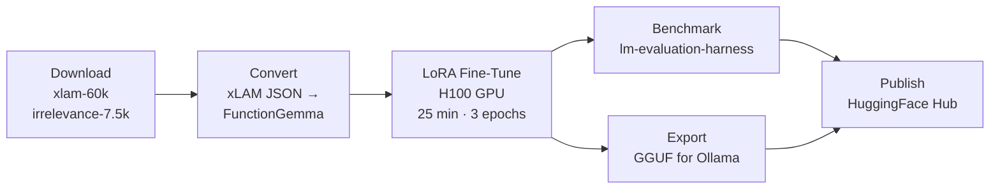

# Tool Agent — FunctionGemma Integration Expert

A fine-tuned FunctionGemma 270M agent that acts as a function/integration expert. Exposes **A2A**, **MCP**, and **WebSocket** protocols so other systems and agents can discover its capabilities and execute tool calls.

Built on Google's [FunctionGemma](https://huggingface.co/google/functiongemma-270m-it) (Gemma 3 270M), fine-tuned with [LoRA](https://arxiv.org/abs/2106.09685) on 13,000 general function-calling examples from [Salesforce xlam-60k](https://huggingface.co/datasets/Salesforce/xlam-function-calling-60k) and [irrelevance/refusal data](https://huggingface.co/datasets/MadeAgents/xlam-irrelevance-7.5k).

| | Link |
|---|---|
| **Fine-tuned model** | [sumitagrawal/functiongemma-270m-tool-agent](https://huggingface.co/sumitagrawal/functiongemma-270m-tool-agent) |
| **Base model** | [unsloth/functiongemma-270m-it](https://huggingface.co/unsloth/functiongemma-270m-it) |
| **Blog post** | [sumitagrawal.dev/blog/finetuning-functiongemma-270m-tool-calling](https://sumitagrawal.dev/blog/finetuning-functiongemma-270m-tool-calling/) |

## Benchmark Results

Evaluated using [lm-evaluation-harness](https://github.com/EleutherAI/lm-evaluation-harness):

| Metric | Base | Fine-tuned | Delta |
|--------|------|-----------|-------|
| Tool Selection Acc | 49.0% | 78.0% | **+29.0%** |
| First Tool Acc | 49.0% | 88.0% | **+39.0%** |
| Negative Rejection | 100.0% | 100.0% | +0.0% |
| Param Accuracy | 49.0% | 68.9% | **+19.9%** |

End-to-end through the tool agent pipeline: **14% → 57%** tool selection accuracy on a 7-query evaluation.

## Quick Start

```bash
pip install -e ".[training]"
```

### Option 1: Use the Fine-tuned Model (Transformers)

The fine-tuned LoRA adapter is in `models/finetuned/`. The backend auto-detects the adapter, downloads the base model, and merges them:

```bash
TOOL_AGENT_BACKEND=transformers \
TOOL_AGENT_MODEL=./models/finetuned \
python -m agent.server
```

Or download from HuggingFace:

```python
from peft import PeftModel
from transformers import AutoModelForCausalLM, AutoTokenizer

base = AutoModelForCausalLM.from_pretrained("unsloth/functiongemma-270m-it")
model = PeftModel.from_pretrained(base, "sumitagrawal/functiongemma-270m-tool-agent")
model = model.merge_and_unload()
tokenizer = AutoTokenizer.from_pretrained("sumitagrawal/functiongemma-270m-tool-agent")
```

### Option 2: Use Gemini API

```bash
TOOL_AGENT_BACKEND=gemini \
GEMINI_API_KEY="your-key" \
python -m agent.server
```

### Option 3: Use Ollama

```bash
ollama create tool-agent -f models/gguf/Modelfile

TOOL_AGENT_BACKEND=ollama \
TOOL_AGENT_MODEL=tool-agent \
python -m agent.server
```

### Verify

```bash
# Health check
curl http://localhost:8888/health

# List available tools
curl http://localhost:8888/tools

# Route a natural language query to a tool
curl -X POST http://localhost:8888/route \
  -H "Content-Type: application/json" \
  -d '{"message": "What is the weather in Tokyo?"}'
```

## Protocols

| Protocol | Endpoint | Purpose |
|----------|----------|---------|
| A2A | `/.well-known/agent-card.json` + `/a2a` | [Agent-to-Agent](https://google.github.io/A2A/) discovery & task execution |
| MCP | `/mcp` | [Model Context Protocol](https://modelcontextprotocol.io) tool exposure |
| WebSocket | `/ws` | Real-time JSON-RPC 2.0 streaming |
| REST | `/tools`, `/route`, `/compose`, `/execute`, `/health` | Direct HTTP tool routing & execution |

## Architecture



### Request Flow



## Examples

See [`examples/`](examples/) for client scripts and integration demos:

| Script | What it does |
|--------|-------------|
| [`rest_client.py`](examples/rest_client.py) | REST API: health, tools, routing, execution |
| [`websocket_client.py`](examples/websocket_client.py) | WebSocket JSON-RPC: list, search, route, execute |
| [`mcp_client.py`](examples/mcp_client.py) | MCP: initialize, tools/list, tools/call |
| [`a2a_client.py`](examples/a2a_client.py) | A2A: AgentCard discovery, task execution |
| [`gemini_firecrawl.py`](examples/gemini_firecrawl.py) | Gemini + Firecrawl MCP end-to-end demo |
| [`base_vs_finetuned_test.py`](examples/base_vs_finetuned_test.py) | Side-by-side model comparison |
| [`finetuned_simple_test.py`](examples/finetuned_simple_test.py) | Fine-tuned model evaluation (7 queries) |

## Training Pipeline



```bash
make download    # Download xlam-60k + irrelevance-7.5k from HuggingFace
make convert     # Convert combined data to FunctionGemma format
make train       # Fine-tune with LoRA via PEFT/TRL
make benchmark   # Compare base vs fine-tuned (lm-evaluation-harness)
make export      # Export to GGUF for Ollama
make publish-hf  # Push LoRA adapter to Hugging Face Hub
```

### Training Data

| Source | Examples | Purpose |
|--------|----------|---------|
| [Salesforce/xlam-function-calling-60k](https://huggingface.co/datasets/Salesforce/xlam-function-calling-60k) | ~10,000 | General function calling |
| [MadeAgents/xlam-irrelevance-7.5k](https://huggingface.co/datasets/MadeAgents/xlam-irrelevance-7.5k) | ~3,000 | Negative / refusal examples |
| **Total** | **~13,000** | |

### Fine-tuning Details

- **Base model**: [`unsloth/functiongemma-270m-it`](https://huggingface.co/unsloth/functiongemma-270m-it) (Gemma 3 270M)
- **Method**: [LoRA](https://arxiv.org/abs/2106.09685) (r=16, alpha=32) via [PEFT](https://huggingface.co/docs/peft) + [TRL](https://huggingface.co/docs/trl) SFTTrainer
- **Hardware**: NVIDIA H100 SXM 80GB via [vast.ai](https://vast.ai)
- **Training time**: 25 minutes (3 epochs)
- **Format**: FunctionGemma native control tokens (`<start_function_call>...`)

## Configuration

| Variable | Default | Description |
|----------|---------|-------------|
| `TOOL_AGENT_PORT` | `8888` | Server port |
| `TOOL_AGENT_HOST` | `0.0.0.0` | Bind address |
| `TOOL_AGENT_MODEL` | `functiongemma` | Model name or path to LoRA adapter directory |
| `TOOL_AGENT_BACKEND` | `ollama` | Backend: `ollama`, `transformers`, `gemini`, or `mock` |
| `OLLAMA_BASE_URL` | `http://localhost:11434` | Ollama API URL |
| `GEMINI_API_KEY` | — | Google AI Studio API key (for `gemini` backend) |
| `N8N_API_KEY` | — | n8n API key (enables n8n workflow tools) |

## Project Structure

```
tool_agent/
├── agent/                  # Runtime agent
│   ├── server.py           # FastAPI application
│   ├── model.py            # Inference backends (Ollama, Transformers, Gemini, Mock)
│   ├── mcp_client.py       # Bridge external MCP servers into the registry
│   ├── router.py           # Tool selection logic
│   ├── composer.py         # Multi-step tool composition
│   ├── tool_registry.py    # Dynamic tool registry
│   ├── config.py           # Environment-based config
│   ├── protocols/          # Protocol implementations
│   │   ├── a2a.py          # Agent-to-Agent (Google A2A)
│   │   ├── mcp.py          # Model Context Protocol
│   │   └── websocket.py    # WebSocket JSON-RPC 2.0
│   └── tools/              # Built-in tools
│       ├── base.py         # Tool base classes
│       └── http.py         # HTTP request tool
├── examples/               # Client examples and integration demos
├── training/               # Training pipeline
│   ├── finetune.py         # LoRA fine-tuning with TRL
│   ├── benchmark.py        # lm-evaluation-harness benchmarking
│   ├── evaluate.py         # Standalone evaluation
│   ├── publish_hf.py       # Hugging Face Hub publishing
│   ├── configs/            # Training hyperparameters (YAML)
│   ├── tasks/              # lm-eval task definitions
│   ├── reports/            # Benchmark reports
│   └── data/               # Training data (gitignored)
├── models/                 # Model files (gitignored)
│   └── finetuned/          # LoRA adapter (adapter_config.json + safetensors)
├── tests/                  # Integration tests (REST, WebSocket, MCP, A2A)
├── pyproject.toml          # Python package config
└── Makefile                # CLI interface
```

## License

Apache 2.0
